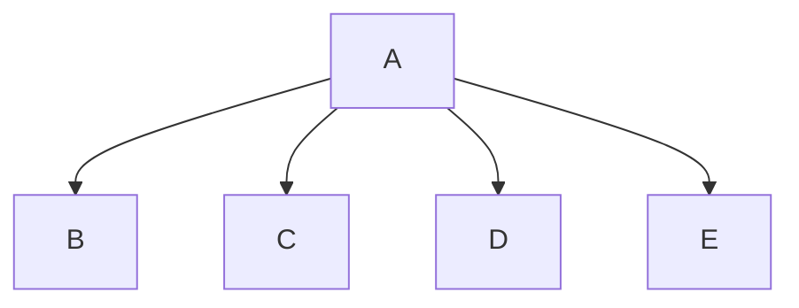

# Caesar Cipher
Oliver, Allen
## <Ceasar_Cipher> Description
One student will design the function main, which will call all other functions in the program. The requirements of the program should be analyzed as a team and split up so each student is given about the same workload (3 functions). The parameters of each function and its return values should be decided ahead of time. Individual function calls should be used to test and debug the program.

### <program_name> Flowchart

#### Function Diagrams

| `main()`    |               |  author     |
| ------------------ | ------------- | ------------ |
| `argument:type`    | takes input from the user for NONE  |              |
| `time:integer`     | calculates NONE  | outputs Functions            |
| `name:string`      | takes input for name NONE | returns total |
***
| `get_shift()`    |               |     author   |
| ------------------ | ------------- | ------------ |
| `argument:type`    | takes input from the user for NONE  |              |
| `time:integer`     | calculates Shift Value  | outputs as string           |
| `name:string`      | takes input for name NONE | returns total |
***
| `choose_option()`    |               |     author   |
| ------------------ | ------------- | ------------ |
| `argument:type`    | takes input from the user for NONE  |              |
| `time:integer`     | calculates user input | outputs true/false         |
| `name:string`      | takes input for name NONE | returns total |
***
| `get_message()`    |               |     author   |
| ------------------ | ------------- | ------------ |
| `argument:type`    | takes input from the user for NONE  |              |
| `time:integer`     | calculates user input  | outputs key          |
| `name:string`      | takes input for name NONE | returns total |
***
| `create_key(shift)`    |               |     author   |
| ------------------ | ------------- | ------------ |
| `argument:type`    | takes input from the user for (shift)  |              |
| `time:integer`     | calculates Shift| outputs as caesar cipher           |
| `name:string`      | takes input for name NONE | returns total |
***
| `encode(message, key)`    |               |     author   |
| ------------------ | ------------- | ------------ |
| `argument:type`    | takes input from the user for message and key |              |
| `time:integer`     | calculates  message  | outputs as string           |
| `name:string`      | takes input for name NONE | returns total |
***
| `decode(message, key)`    |               |     author   |
| ------------------ | ------------- | ------------ |
| `argument:type`    | takes input from the user for message and key  |              |
| `time:integer`     | calculates message  | outputs as string           |
| `name:string`      | takes input for name NONE | returns total |
***
