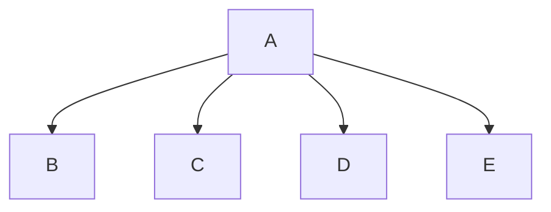

# Caesar Cipher
Oliver, Allen
## <Ceasar_Cipher> Description
One student will design the function main, which will call all other functions in the program. The requirements of the program should be analyzed as a team and split up so each student is given about the same workload (3 functions). The parameters of each function and its return values should be decided ahead of time. Individual function calls should be used to test and debug the program.

### <program_name> Flowchart

#### Function Diagrams

| `function name1`    |               |  author     |
| ------------------ | ------------- | ------------ |
| `argument:type`    | takes input from the user for ____  |              |
| `time:integer`     | calculates ______  | outputs ____             |
| `name:string`      | takes input for name ___ | returns total |
***
| `function name2`    |               |     author   |
| ------------------ | ------------- | ------------ |
| `argument:type`    | takes input from the user for ____  |              |
| `time:integer`     | calculates ______  | outputs ____             |
| `name:string`      | takes input for name ___ | returns total |
***
